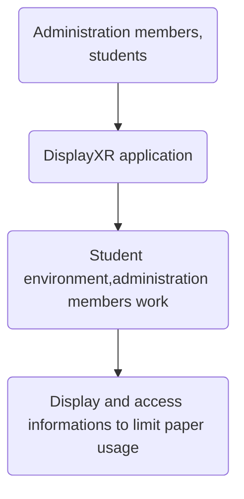

# DisplayXR: by Maxime BASSET, Evan BOYER, Thomas CERQUIERA, Ogené JOSEPH 
## Introduction
DisplayXR is a mobile application designed to improve students and administration members Castres university enclosures, while reducing paper usage.
Through a augmented  university environnement, where each people can find Castres university informations by virtual white board providing display documents
## Corn Beast

## Features
### Main features
- Thanks to the phone camera and geolocalisations data:
    - view the augmented environnement on smartphones
    - view, consult virtuals documents
    - connexion/deconnexion
    - account create,read our personals informations, update,delete
#### Administration members features
- Read currents documents displayed on the white bords
- Create,delete,update documents on the application
  
### Secondary features
- Download virtuals documents
- Have informations(occupency timetables) on class rooms when we are infront of them 
### Won't have features
- Facial reconisation boosted by artificial intelligence to display informations about professors when they are on the screens
## Screens

