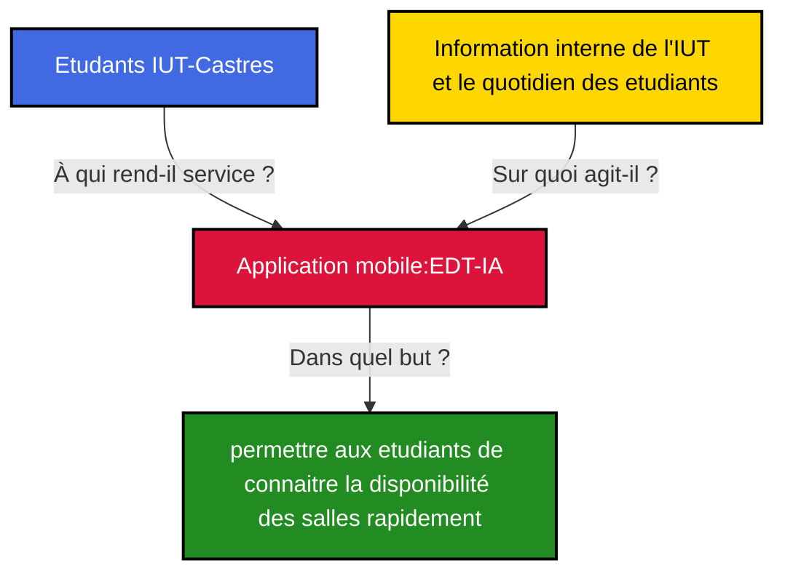
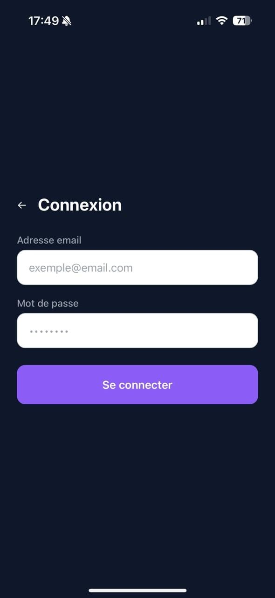
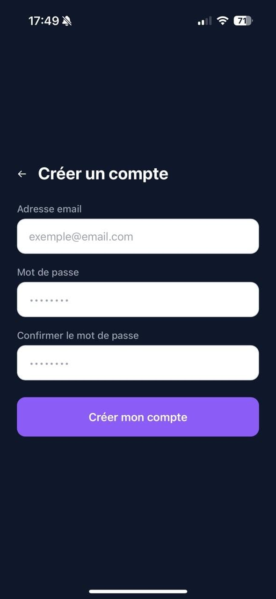
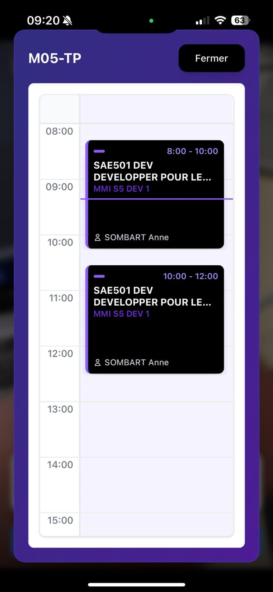

# EDT-AI: Maxime BASSET, Evan BOYER, Thomas CERQUIERA, Ogené JOSEPH 
## Introduction
EDT-IA: Est une application mobile, permettant de visualiser l'emploi de temps de chaque salle de cours du pôle " métiers du multimédia et de l'internet " de l'IUT de CASTRES, grâce à la détection de texte par intelligence artificielle via la caméra du smartphone.Ce projet à pour objectif de permettre au utilisateurs finaux, à savoir les étudiants du campus, d'avoir à porté de main l'emploi du temps des salles de manière rapide,pour leurs usages quotidiens de celles-ci.
### Fonctionnement 
Pour le fonctionnement, l'utilisateur se munit de son téléphone pour scanner l'intitulé des portes de l'IUT, ensuite l'emploi du temps du jours de la salle est affiché sur l'écran avec toutes les informations correspondantes.

## Corn Beast

## Fonctionnalités

### Fonctionnalité principale
- Affichage des emplois du temps des salles au scan avec la caméra du téléphone
### Fonctionnalité secondaire
- Connexion, incription, déconnexion
### Should have
- consulter les emplois du temps des salles par une saisie du nom de la salle sur l'interface
### Won't have 
- avoir son propre emploi du temps sur l'application
- avoir l'emploi du temps hebdomadaire des salles ou sur de plus longues durrées
## Screens
 
 
  
 
### Video de démonstration

https://github.com/user-attachments/assets/3c475a92-3461-4a4f-bfbb-141bed601cee

## Architecture
### Backend
Cette application utilise une API interne à l'I.U.T de Castres pour la récupération des données des emplois du temps.
Une base de donnée en MongoDB avec express.js
### Front-end
Le framework javascript `React` à été utilisé pour développer ce projet avec l'implémentation de l'environnement d'exécution `Capacitor` qui permet de développer des projets avec des technologies web pour une exécution en natif sur mobile ou ordinateur.
### Et la technologie novatrice l'IA
Dans ce projet nous avons utilisé l'intelligence artificielle Tesseract (IA) spécialisée dans la gestion de texte et la génération d'images.

